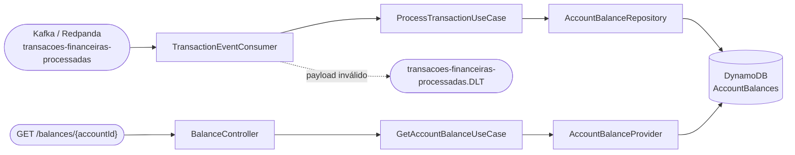

# API de Consulta de Saldo — Desafio Técnico Itaú Unibanco

[](../../actions/workflows/build.yml)
[](../../actions/workflows/test.yml)
[](../../actions/workflows/docker.yml)
[](../../actions/workflows/codeql.yml)

Serviço que consome transações financeiras de um tópico Kafka, projeta o saldo de cada conta no
DynamoDB e expõe esse saldo por um endpoint REST.

```bash
make up                                                          # sobe tudo
make kafka-produce-scenario TOPIC=transacoes-financeiras-processadas   # publica um cenário
curl http://localhost:8080/balances/{accountId}                  # consulta o saldo
```

## Sumário

- [Arquitetura](#arquitetura)
- [Decisões de design](#decisões-de-design)
- [O que não foi implementado, e por quê](#o-que-não-foi-implementado-e-por-quê)
- [Como rodar](#como-rodar)
- [Como verificar os cenários difíceis](#como-verificar-os-cenários-difíceis)
- [Contrato da API](#contrato-da-api)
- [Configuração](#configuração)
- [Testes](#testes)
- [Estrutura de pastas](#estrutura-de-pastas)
- [Sobre o uso de IA](#sobre-o-uso-de-ia)

## Arquitetura



Arquitetura hexagonal, seguindo a estrutura do starter-kit: o domínio não conhece Spring, Kafka
nem AWS. Toda comunicação com o mundo externo passa por **portas** (interfaces) implementadas
por **adaptadores**. A regra é validada automaticamente por `HexagonalArchitectureTest`
(Konsist), que quebra o build se uma camada violar a direção de dependência — incluindo três
verificações próprias: o núcleo não pode importar `org.springframework`, `software.amazon.awssdk`
nem `org.apache.kafka`.

## Decisões de design

### 1. O serviço projeta um snapshot, não acumula um ledger

Cada mensagem do tópico já traz `account.balance` — o saldo apurado pelo autorizador no instante
da transação. **O saldo não é recalculado somando créditos e subtraindo débitos.**

Recalcular seria estritamente pior: exigiria que todo evento chegasse exatamente uma vez e em
ordem — nada disso é garantido pelo Kafka entre partições — e qualquer falha corromperia o saldo
permanentemente, sem forma de se recuperar. Projetar o snapshot torna cada evento autossuficiente,
e é justamente isso que permite resolver duplicatas e desordem por comparação de versões.

### 2. Modelagem no DynamoDB

Tabela `AccountBalances`, **um item por conta**:

| Atributo | Tipo | Papel |
|-|-|-|
| `accountId` | S | **partition key** |
| `owner` | S | titular |
| `balanceAmount` | N | saldo, decimal exato |
| `balanceCurrency` | S | ISO 4217 |
| `lastTransactionId` | S | rastreabilidade: qual transação produziu este saldo |
| `version` | N | timestamp da transação em microssegundos — a versão do snapshot |
| `updatedAt` | S | cópia legível, **somente escrita** (nunca lida pela aplicação) |

**Sem sort key e sem índice secundário**, e isso é deliberado. O único padrão de acesso do
serviço é "o saldo atual desta conta", que uma partition key responde com um `GetItem` de
milissegundos. Em DynamoDB a modelagem segue os padrões de acesso, não as entidades — o
contrário de um banco relacional, onde se normaliza primeiro e consulta depois.

`updatedAt` é denormalização consciente: existe para quem abrir o item num console ou numa
consulta de suporte ver uma data em vez de um inteiro de 16 dígitos. Como nunca é lido de volta,
não pode divergir de `version`, que continua sendo a única fonte de verdade da ordenação.

#### Sort key: só com histórico como requisito

Uma sort key faria sentido para manter **histórico** de saldos por conta. Com `accountId` (PK) +
`version` (SK), cada evento passaria a ter uma chave distinta, nada seria sobrescrito e a conta
acumularia um item por transação.

O efeito colateral interessante é que o problema de ordenação **mudaria de lugar**, não
desapareceria: sem sobrescrita não há o que proteger na escrita, e a leitura é que passaria a
resolver a ordem, com `Query(ScanIndexForward=false, Limit=1)`. Trocaríamos a operação mais
barata do DynamoDB por uma mais cara no caminho crítico da API, e a tabela cresceria
indefinidamente, exigindo TTL ou arquivamento.

Se histórico e leitura barata fossem exigidos ao mesmo tempo, há dois desenhos possíveis.

O **híbrido na mesma tabela**: itens `v#<version>` para o histórico e um item `CURRENT` para o
saldo vigente, escritos juntos num `TransactWriteItems`. A leitura da API volta a ser um `GetItem`
de chave fixa, e o `CURRENT` passa a precisar exatamente da escrita condicional descrita na
[decisão 3](#3-concorrência-e-ordenação-uma-condição-resolve-três-problemas), porque só ele
sofre sobrescrita.

A **tabela separada**, que é provavelmente o desenho melhor. `AccountBalances` continua pequena,
quente e com um item por conta; `AccountBalanceHistory` cresce isolada, com TTL, capacidade e
perfil de acesso próprios. As vantagens são de operação, não de modelagem: uma varredura analítica
sobre o histórico não consome capacidade da tabela que atende a API, o TTL do histórico não
arrisca apagar o saldo vigente por engano, e as duas escalam de forma independente. O preço é
perder a atomicidade entre as duas escritas — mas isso não custa nada aqui, porque cada evento é
um snapshot autossuficiente e a projeção é idempotente, então o histórico pode ser preenchido de
forma assíncrona e eventualmente consistente sem afetar a corretude do saldo.

Essa tabela seria alimentada por DynamoDB Streams ou, melhor ainda, por um **consumidor
independente do mesmo tópico** — o que na prática significa outro serviço, com outro dono e outro
ciclo de vida, em vez de mais responsabilidade neste.

Nada disso foi feito porque o histórico **já existe na fonte**: o Kafka retém os eventos, e a
projeção é determinística, então uma tabela de histórico pode ser construída a qualquer momento
reprocessando o tópico do offset zero. Materializá-la aqui seria pagar escrita e armazenamento em
toda ingestão para responder a uma pergunta que este serviço não recebe.

#### GSI: o único candidato seria `owner`, e ele tem um defeito semântico

Investigações de suporte costumam partir do cliente, não da conta — o `accountId` raramente está à
mão. Um GSI por `owner` responderia "quais contas são deste titular".

Foi descartado por um motivo que precede o custo: **este serviço só conhece contas que já
transacionaram**. Uma conta recém-aberta não existe nesta tabela, então o índice responderia
"estas duas" quando o cliente tem três — e nada na resposta indicaria que ela está incompleta. Uma
resposta parcial que se apresenta como completa é pior que resposta nenhuma, porque quem consulta
age sobre ela. Essa pergunta pertence ao cadastro de contas, onde a resposta é completa por
construção. Para o caso concreto de investigação, incluir o `owner` nos logs de ingestão — que já
são emitidos — resolve mais barato que qualquer índice.

Se o requisito aparecer, o desenho seria:

```
GSI OwnerAccountsIndex — PK: owner, projeção: KEYS_ONLY
```

`KEYS_ONLY` importa mais do que parece. O DynamoDB só cobra escrita no índice quando a **entrada
do índice muda**; como aqui só o saldo varia entre um evento e outro, e `owner`/`accountId`
permanecem idênticos, o índice seria escrito **uma vez por conta** — na primeira transação dela —
e ficaria inerte nas milhares seguintes. Com `ALL`, o `balanceAmount` estaria projetado e toda
ingestão pagaria escrita dobrada, 24/7. A projeção não pode ser alterada depois: mudá-la exige
recriar o índice.

Mesmo com o índice, o saldo continuaria vindo da tabela base: o `Query` no GSI serviria para
descobrir os `accountId`s, e cada saldo sairia de um `GetItem`, porque **GSI nunca oferece leitura
fortemente consistente** — a garantia da [decisão 6](#6-leitura-fortemente-consistente) não
sobreviveria a ser servida pelo índice.

Os demais atributos não são candidatos. `lastTransactionId` guarda apenas a última transação, então
um índice sobre ele só encontraria a transação caso ela ainda fosse a mais recente da conta —
achando às vezes, sem que o consultante saiba em qual dos dois casos está. `balanceCurrency` teria
cardinalidade próxima de 1 e concentraria todos os itens numa única partição. `updatedAt` como
partition key criaria partição quente por período. E perguntas sobre faixas de saldo ou contas
inativas são analíticas: o caminho para elas é DynamoDB Streams para um destino analítico, nunca um
índice na tabela transacional.

### 3. Concorrência e ordenação: uma condição resolve três problemas

O coração da solução é a condição do `PutItem`:

```
attribute_not_exists(accountId) OR version < :version
```

O DynamoDB avalia essa expressão **dentro da escrita**, na partição dona do item — portanto de
forma atômica, mesmo com várias instâncias do consumidor gravando a mesma conta no mesmo
microssegundo. Um `read-then-write` no caso de uso seria uma condição de corrida clássica.

Como a comparação é **estrita** (`<`, não `<=`), ela cobre três casos com uma regra só:

| Caso | Por que a condição resolve |
|-|-|
| **Fora de ordem** | evento atrasado tem `version` menor → rejeitado, saldo não retrocede |
| **Duplicata** | reprocessamento tem `version` **igual** → não é menor → rejeitado. Idempotência sem tabela de deduplicação para manter e expirar |
| **Concorrência** | de duas escritas simultâneas, a mais antiga perde, independentemente de qual chegar primeiro à partição |

A `ConditionalCheckFailedException` é tratada como resultado normal (`false`), nunca como erro.
Se vazasse como exceção, toda duplicata seria retentada e depois mandada para o DLT.

**Sobre a chave da partição no Kafka:** o gerador do starter-kit publica **sem chave**, então
eventos da mesma conta se espalham por partições diferentes e são consumidos concorrentemente —
o pior caso, de propósito. Se o autorizador usasse `accountId` como chave, o Kafka garantiria
ordem por conta e o problema quase desapareceria. Mas o produtor está fora do escopo e não é
contrato: um retry dele ainda geraria duplicata. A correção não pode depender do broker; ela
vem da escrita condicional. `TransactionEventConsumerIntegrationTest` publica sem chave
justamente para provar isso.

### 4. Precisão monetária — e um comportamento do DynamoDB que muda o contrato

Todo valor é `BigDecimal`, nunca `Double`, do payload até a resposta HTTP. Ponto flutuante
binário não representa `0.01` exatamente, e um saldo carregado por `Double` desvia.

Menos óbvio, e descoberto pelos testes de integração: **o DynamoDB remove zeros à direita de
atributos numéricos.** Um saldo gravado como `300.00` volta como `300`. Sem tratamento, a API
responderia `"amount": 300` para um saldo em reais, e o mesmo saldo teria representações
diferentes antes e depois de passar pelo banco.

Por isso `Money` normaliza a escala usando `java.util.Currency`: BRL tem 2 casas, JPY tem 0,
BHD tem 3 — a escala correta é propriedade da moeda, não um `2` fixo no código. Isso também
substituiu a validação por regex por validação ISO 4217 de verdade (`ZZZ` é rejeitado).

Um valor com mais precisão do que a moeda admite (`1.234` em BRL) é **rejeitado**, não
arredondado. `RoundingMode.UNNECESSARY` é intencional: arredondar dinheiro em silêncio é como
centavos desaparecem. Se o produtor mandou algo que este serviço não entende, o evento vai para
o DLT onde uma pessoa pode olhar.

### 5. `balance.apply-declined-transactions` — uma ambiguidade explícita

Uma transação **DECLINED** deve atualizar o saldo? A especificação não diz, então virou flag em
vez de regra escondida no código.

**Padrão `true`.** Uma transação recusada continua carregando um snapshot válido: o autorizador
avaliou a conta naquele microssegundo e informou o saldo. Recusar um débito por saldo
insuficiente não move dinheiro, mas não torna o saldo informado incorreto. Descartar esses
eventos significaria ignorar a leitura mais recente do sistema — e numa conta cujas transações
são majoritariamente recusadas, o saldo armazenado envelheceria sem motivo.

Com `false`, apenas APPROVED atualiza o saldo — leitura mais conservadora ("saldo muda quando
dinheiro se move"), e a escolha certa se algum dia se constatar que o autorizador emite o saldo
*pré-autorização* nas recusas. A corretude se mantém nos dois modos; muda apenas o frescor,
porque a versão gravada passa a ser a do último APPROVED e um APPROVED posterior continua
aplicando normalmente.

### 6. Leitura fortemente consistente

`GetItem` usa `consistentRead(true)`. Custa o dobro de capacidade de leitura e vale a pena: com
consistência eventual, um cliente que acabou de ver a transação confirmada poderia consultar e
receber o **saldo anterior**, servido por uma réplica atrasada. Num endpoint de saldo isso é
lido como erro do banco, não como cache velho.

### 7. Resiliência

**Retry com backoff exponencial e jitter** (`ExponentialBackOff`, 3 tentativas, 500ms → 5s). O
jitter existe porque um throttle do DynamoDB atinge todas as threads ao mesmo tempo: com backoff
idêntico, todas retentariam em sincronia e voltariam a estrangular a tabela em ondas.

**Separação entre falha transitória e payload inválido.** É a distinção que mais importa em
operação:

- **Transitório** (timeout, throttling, conexão caída) → retenta. O offset não avança sobre um
  evento que não foi aplicado.
- **Inválido** (`InvalidTransactionEventException`) → vai **direto para o DLT**, sem retry.
  Retentar não adianta — o payload continuará malformado em 500ms — e, pior, travaria o
  consumidor naquele offset, parando toda a fila de mensagens boas atrás dele na mesma partição.
  Um registro ruim derrubaria uma partição inteira.

**Timeouts explícitos no AWS SDK.** O padrão do `apiCallTimeout` é *ilimitado*. Sem ele, uma
partição do DynamoDB que para de responder sem fechar a conexão prende uma thread do Tomcat para
sempre; algumas dessas e a API inteira para de atender — inclusive o health check — por causa de
uma dependência apenas degradada. `apiCallAttemptTimeout` (1s) limita a tentativa individual;
`apiCallTimeout` (3s) limita a chamada inteira, deixando espaço para os retries do próprio SDK.

**Tópicos declarados como beans** (`KafkaAdmin`). O Redpanda desta stack tem
`auto_create_topics_enabled=false`; sem isso a aplicação subiria, se inscreveria em nada e
ficaria com aparência saudável consumindo zero mensagens. O DLT precisa existir de antemão: 
descobrir que ele falta no momento de quarentenar uma mensagem é o pior momento possível.

### 8. Erros HTTP como contrato

Respostas de erro em `application/problem+json` (RFC 7807). A API é consumida por outros
sistemas, então o erro precisa ser tão legível por máquina quanto o sucesso:

| Situação | Status | Por quê |
|-|-|-|
| Saldo não projetado | `404` | não adianta retentar |
| `accountId` não é UUID | `400` | rejeitado pelo framework, antes de qualquer chamada ao banco |
| Banco indisponível | `503` | **não 500**: sinaliza ao chamador que retentar é a resposta certa, em vez de acionar um humano para investigar este serviço |
| Falha inesperada | `500` | contrato mesmo no caso que ninguém previu, com mensagem neutra |
| Rota inexistente, método não suportado | `404` / `405` | tratados pelo Spring MVC, mas **no mesmo formato** |

O contrato vale para a API inteira, e não só para os caminhos antecipados. Sem
`spring.mvc.problemdetails.enabled`, as exceções tratadas pelo próprio Spring sairiam no formato
legado `{"timestamp","status","error","path"}` — a API falaria dois dialetos de erro, e um
consumidor com parser de RFC 7807 quebraria ao errar a URL.

Isso exige dois advices com ordens opostas, e a razão é sutil: os handlers específicos precisam de
`HIGHEST_PRECEDENCE` para vencer o handler do Spring em `MethodArgumentTypeMismatchException`,
enquanto o catch-all `Exception` precisa de `LOWEST_PRECEDENCE` — com precedência alta ele
capturaria as exceções do próprio framework e transformaria um `405` em `500`. `ErrorContractTest`
verifica as duas pontas.

Detalhes internos nunca atravessam essa fronteira — stack trace e mensagem da AWS vão para o
log, e o chamador recebe uma mensagem estável e neutra. Vazá-los entregaria topologia de
infraestrutura a quem chama o endpoint; há teste garantindo que host interno, credencial e nome
de classe não aparecem no corpo de um `500`.

A exceção `AccountBalanceStorageException` é declarada na **porta**, não no domínio: 
indisponibilidade é propriedade do contrato entre o núcleo e o mundo externo, não regra de
negócio. É isso que permite o adaptador traduzir `SdkException` sem que o caso de uso ou o
adaptador web importem um tipo da AWS.

### 9. Observabilidade

Métricas de negócio por resultado, não só throughput — porque os sinais interessantes são
proporções. Um consumidor que descarta todo evento como obsoleto parece tão ocupado quanto um
saudável se você olhar só a contagem de mensagens:

```
balance_transactions_processed_total{outcome="applied"}
balance_transactions_processed_total{outcome="stale_discarded"}
balance_transactions_processed_total{outcome="declined_skipped"}
balance_transactions_rejected_total
```

Os contadores são registrados **na inicialização**, não na primeira ocorrência: uma série que só
aparece depois do primeiro evento é uma armadilha para alertas, já que "taxa zero" e "série não
existe" são condições diferentes.

Health com probes de liveness e readiness separadas, e a separação tem consequência real: um
`HealthIndicator` verifica a tabela do DynamoDB e entra **apenas** no grupo de readiness. Um
contêiner que perdeu o banco para de receber tráfego (not ready) sem ser morto e reiniciado
(still alive) — reiniciar não conserta nada quando o problema é a dependência, e a liveness caindo
junto colocaria o orquestrador em ciclo de reinício durante a indisponibilidade.

A verificação usa `DescribeTable`, não uma leitura de item: confere conectividade, credenciais e
existência da tabela sem consumir capacidade de leitura numa probe que roda de segundos em
segundos, para sempre. `HealthProbesTest` fixa a composição dos dois grupos, que é fácil de
quebrar sem ninguém notar — no dia a dia tudo responde `UP` de qualquer jeito.

**Graceful shutdown** ligado (`server.shutdown: graceful`): ao receber SIGTERM, o Tomcat para de
aceitar conexões e espera as requisições em voo, e o consumidor termina o lote antes de commitar o
offset. Sem isso — o padrão do Boot é `immediate` — todo deploy devolve erro a quem estava sendo
atendido naquele instante.

**Logs estruturados** em JSON (Elastic Common Schema) quando `LOG_FORMAT=ecs`, como o
docker-compose define. Rodando pela IDE, o padrão continua sendo o formato legível por humanos.

Os identificadores vão para o **MDC**, não interpolados no texto — é o que os torna campos de
primeira classe no agregador:

```json
{
  "message": "Evento obsoleto descartado: o saldo armazenado já é mais recente",
  "account": "1277d415-4c97-482d-a363-18e18aea761d",
  "owner": "83360aee-215b-47b3-b5a4-b3b4de10db77",
  "transaction": "78010165-3c17-4040-a4a3-339f6dba72ac",
  "version": "1788293030916214"
}
```

`account:1277d415-…` vira uma consulta; procurar o mesmo UUID dentro de texto livre dependeria de
regex e de a mensagem nunca mudar de formato.

`owner` está ali porque investigações raramente começam pela conta: quem abre um chamado é o
titular. Sem esse campo seria preciso primeiro descobrir quais contas são dele para só então
filtrar o log — e é também a razão de não existir um GSI por `owner`: resolver isso no log custa
um campo, resolver no banco custaria escrita em toda ingestão.

**Log de acesso HTTP** (`RequestLoggingFilter`), uma linha por requisição com método, rota, status
e duração — também no MDC, mais `account` e `owner` quando a conta é encontrada.

Os nomes de campo são **os mesmos da ingestão**, e é aí que está o ganho: uma única consulta por
`owner` devolve os eventos consumidos e as chamadas à API daquele titular, em ordem cronológica.

```
20:13:56.659  INGESTÃO   Evento obsoleto descartado: o saldo armazenado já é mais recente
20:13:56.671  INGESTÃO   Evento obsoleto descartado: o saldo armazenado já é mais recente
20:13:56.675  INGESTÃO   Evento obsoleto descartado: o saldo armazenado já é mais recente
20:14:03.675  CONSULTA   GET /balances/7deba977-2a27-4b30-b352-a7074d6c062a -> 200 (31ms)
```

Quem preenche é o controller — primeiro ponto que conhece o titular, já que a URL só carrega o
identificador da conta —, e quem escreve a linha é o filtro, no `finally`. Sem conta encontrada o
campo simplesmente não aparece, o que é melhor que um vazio sugerindo titular desconhecido. Sem ele existiriam apenas métricas agregadas, que não respondem à
pergunta de uma investigação: "este sistema chamou às 14h32? o que recebeu?". As chamadas ao
actuator ficam de fora: as probes batem de segundos em segundos e encheriam o agregador de linhas
que ninguém consulta.

O caminho feliz da ingestão fica em `DEBUG` de propósito — logar cada saldo aplicado afogaria o
log em volume de produção. O rastro definitivo não depende de log: está no próprio item
persistido (`lastTransactionId` e `version`) e no evento retido pelo Kafka. Para investigar um
caso, basta subir o nível do pacote, sem deploy:
`logging.level.br.com.itau.challenge.balance.adapter.input.kafka=DEBUG`.

## O que não foi implementado, e por quê

### Circuit breaker

**Não implementado, por decisão consciente.** O critério de avaliação cita *"onde oportuno"*, e
saber onde **não** aplicar é parte da resposta.

**Onde faria sentido:** no caminho de **leitura** (`GET /balances`). Se o DynamoDB degrada e cada
chamada pendura por segundos, o pool de threads do Tomcat esgota e a API inteira cai junto. Um
breaker aberto converte uma *falha lenta* — que se propaga e derruba o chamador — numa *falha
rápida* (`503` imediato), que o chamador consegue tratar. Os timeouts explícitos do SDK já
cobrem boa parte disso; o breaker acrescentaria o "pare de tentar por um tempo".

**Onde eu deliberadamente não aplicaria:** no **consumidor Kafka**. Ali o Kafka já *é* o circuit
breaker: se o banco cai, o offset não é commitado, o lag cresce, e o backlog é drenado quando o
banco volta. Não há ninguém esperando resposta. Um breaker aberto ali seria não só redundante,
mas ativamente nocivo — faria mensagens válidas falharem e caírem no DLT sem necessidade.

**Como implementaria:** `resilience4j-circuitbreaker` (módulo core, que depende apenas de
`resilience4j-core` e `slf4j-api`), aplicado como *decorator* sobre `AccountBalanceProvider`.
Não o starter `resilience4j-spring-boot3`: ele é construído sobre Spring Framework 6 e este
projeto roda Spring Boot 4 / Framework 7 — não existe `resilience4j-spring-boot4`. O decorator
sobre a porta, aliás, encaixa melhor no hexágono do que a anotação: o domínio continuaria sem
saber que existe um breaker.

### Outros pontos

- **Autenticação/autorização** — fora do escopo; em produção o endpoint estaria atrás de um API
  gateway com mTLS ou OAuth2, e o actuator não ficaria com `show-details: always`.
- **Credenciais estáticas da AWS** — necessárias para o DynamoDB Local. Em produção seriam IAM
  roles via `DefaultCredentialsProvider`, sem segredo nenhum no código.
- **Reprocessamento do DLT** — hoje as mensagens ficam retidas para inspeção manual. O próximo
  passo natural é um endpoint ou job de replay, com limite de tentativas por mensagem.
- **Rastreamento distribuído** — Micrometer Tracing com propagação do `traceId` do autorizador
  até a resposta HTTP tornaria possível seguir uma transação ponta a ponta.
- **Cache de leitura** — não incluído de propósito. Saldo é o dado onde staleness custa mais
  caro, e a leitura consistente já é de milissegundos.

## Como rodar

Pré-requisito único: **Docker** (com Docker Compose). `make` já vem em Linux e macOS; no Windows,
use WSL2.

```bash
make up      # sobe app + DynamoDB + Redpanda + seeds + consoles
make logs    # acompanha os logs
make stop    # derruba tudo
```

| Console | URL |
|-|-|
| Aplicação | http://localhost:8080 |
| Swagger UI | http://localhost:8080/swagger-ui/index.html |
| OpenAPI (JSON) | http://localhost:8080/v3/api-docs |
| Health | http://localhost:8080/actuator/health |
| Métricas Prometheus | http://localhost:8080/actuator/prometheus |
| DynamoDB Admin | http://localhost:8001 |
| Redpanda Console | http://localhost:8081 |

### Desenvolvimento pela IDE

```bash
make db-up      # só DynamoDB + console
make kafka-up   # só Redpanda + console
```

Os valores padrão de `application.yaml` já apontam para essas portas — rode `Application.kt`
direto, sem variável de ambiente nenhuma.

## Como verificar os cenários difíceis

O gerador do starter-kit (`make kafka-produce-transactions-events`) sorteia um `accountId` novo
a cada evento, então **nunca produz dois eventos da mesma conta** — ou seja, não exercita
desordem, duplicata nem concorrência. Para isso existe um cenário determinístico:

```bash
make kafka-produce-scenario TOPIC=transacoes-financeiras-processadas
```

Ele publica 6 eventos para **uma única conta**, sem chave Kafka (portanto espalhados entre
partições e consumidos concorrentemente):

| # | Evento | Resultado esperado |
|-|-|-|
| 1 | transação do meio (`t2`, saldo 200.00) | aplicada |
| 2 | transação mais antiga (`t1`, saldo 100.00) | **descartada** — fora de ordem |
| 3 | transação mais nova (`t3`, saldo 300.00) | aplicada |
| 4 | réplica idêntica de `t3` | **descartada** — duplicata |
| 5 | réplica de `t2` | **descartada** — obsoleta |
| 6 | `type: "TRANSFER"` (inválido) | **dead-letter**, saldo intacto |

O comando imprime o `accountId` e o `curl` para conferir. O saldo final é **300.00**,
independentemente da ordem em que o consumidor processou as mensagens.

Verificação real desta implementação:

```console
$ curl -s http://localhost:8080/balances/e304f264-e5d8-4512-bf7c-f99a46f2b0e6
{"id":"e304f264-...","owner":"518d8602-...","balance":{"amount":300.00,"currency":"BRL"},
 "updated_at":"2026-08-31T20:27:19.484800-03:00"}

$ curl -s http://localhost:8080/actuator/prometheus | grep balance_transactions
balance_transactions_processed_total{outcome="applied"} 2.0
balance_transactions_processed_total{outcome="stale_discarded"} 3.0
balance_transactions_processed_total{outcome="declined_skipped"} 0.0
balance_transactions_rejected_total 1.0
```

Os números contam a história inteira: 2 aplicadas, 3 descartadas (1 fora de ordem + 2
duplicatas), 1 rejeitada para o DLT.

```bash
make db-scan                                                  # itens no DynamoDB
make kafka-consume TOPIC=transacoes-financeiras-processadas.DLT   # mensagens em quarentena
```

## Contrato da API

### `GET /balances/{accountId}`

| Parâmetro | Local | Tipo | Descrição |
|-|-|-|-|
| `accountId` | Path | UUID | Identificador da conta |

**200 OK**

```json
{
  "id": "5b19c8b6-0cc4-4c72-a989-0c2ee15fa975",
  "owner": "315e3cfe-f4af-4cd2-b298-a449e614349a",
  "balance": { "amount": 183.12, "currency": "BRL" },
  "updated_at": "2025-07-04T12:02:44.589998-03:00"
}
```

`updated_at` tem **largura fixa**, sempre com 6 dígitos de fração e offset explícito. O formatador
ISO padrão do Java imprime o mínimo de dígitos — `.4848` num caso, `.589998` noutro e nada num
segundo cheio — e um consumidor que espera layout fixo quebraria na variante que encontrasse
depois. Seis dígitos porque a origem é microssegundos.

O instante vem do **timestamp da transação**, não do relógio do servidor: `updated_at` significa
"quando este saldo passou a valer", não "quando este serviço consumiu a mensagem". Isso também
torna a projeção determinística — reprocessar o tópico do offset zero produz itens idênticos.

**Erros:** `400` (UUID malformado), `404` (sem saldo projetado), `503` (banco indisponível), todos
em `application/problem+json`.

## Configuração

| Variável | Padrão | Descrição |
|-|-|-|
| `DYNAMODB_ENDPOINT` | `http://localhost:8000` | endpoint do DynamoDB |
| `DYNAMODB_REGION` | `us-east-1` | região |
| `BALANCE_TABLE_NAME` | `AccountBalances` | tabela de saldos |
| `DYNAMODB_API_CALL_ATTEMPT_TIMEOUT_MS` | `1000` | timeout de uma tentativa HTTP |
| `DYNAMODB_API_CALL_TIMEOUT_MS` | `3000` | timeout da chamada inteira, com retries |
| `KAFKA_BOOTSTRAP_SERVERS` | `localhost:19092` | broker |
| `KAFKA_CONSUMER_GROUP_ID` | `balance-transaction-consumer` | consumer group |
| `KAFKA_LISTENER_CONCURRENCY` | `3` | threads do listener (uma por partição) |
| `TRANSACTIONS_TOPIC` | `transacoes-financeiras-processadas` | tópico consumido |
| `TRANSACTIONS_TOPIC_PARTITIONS` | `3` | partições do tópico e do DLT |
| `APPLY_DECLINED_TRANSACTIONS` | `true` | se DECLINED atualiza o saldo — ver [decisão 5](#5-balanceapply-declined-transactions--uma-ambiguidade-explícita) |
| `API_TIME_ZONE` | `America/Sao_Paulo` | fuso usado para renderizar `updated_at` |

## Testes

```bash
make test               # unitários + gate de cobertura ≥ 90%, dentro de container
make integration-test   # integração contra DynamoDB e Redpanda reais
```

**Cobertura: 98,2%** de instruções (gate: 90%).

### Unitários (`src/test`)

Sem infraestrutura externa. Portas são substituídas por fakes — para `fun interface`, um lambda
basta e é mais legível que um mock. Cobrem domínio, casos de uso, mapeamentos e os adaptadores
com o cliente DynamoDB mockado, além do teste de arquitetura.

### Integração (`src/integrationTest`)

Rodam contra infraestrutura real, porque provam coisas que mock nenhum prova. Se
`attribute_not_exists(...) OR version < :version` de fato rejeita uma versão igual é uma pergunta
sobre a avaliação de expressões do DynamoDB, não sobre este código: um teste unitário que verifica
a *string* da expressão prova a string.

Destaques:

- **`converge para a versão mais recente independentemente da ordem de chegada`** — aplica os mesmos três
  eventos em **todas as permutações** de ordem e verifica que o estado final é sempre o mais
  recente.
- **`rejeita um reenvio byte a byte idêntico do mesmo evento`** — idempotência contra o banco de verdade.
- **`manda um evento inprocessável ao DLT e deixa o saldo intacto`** — publica um payload inválido, consome o DLT e
  confirma que o saldo não foi tocado.
- **`assenta no evento mais recente mesmo com outros mais antigos chegando depois`** — ponta a ponta, pelo
  listener real, com mensagens sem chave.

> Estes testes encontraram o comportamento de truncamento de zeros do DynamoDB descrito na
> [decisão 4](#4-precisão-monetária--e-um-comportamento-do-dynamodb-que-muda-o-contrato). Ele não
> aparecia em nenhum teste unitário.

## Estrutura de pastas

```
src/main/kotlin/br/com/itau/challenge/
├── Application.kt
└── balance/
    ├── domain/          # modelos e exceções — sem framework algum
    │   ├── model/       # Money, Transaction, Account, AccountBalance, ProcessedTransaction
    │   └── exception/
    ├── port/
    │   ├── input/       # ProcessTransactionUseCase, GetAccountBalanceUseCase
    │   └── output/      # AccountBalanceRepository, AccountBalanceProvider
    ├── application/     # ProcessTransactionService, GetAccountBalanceService
    └── adapter/
        ├── input/kafka/ # consumer, mapper, métricas, error handler + DLT
        ├── input/web/   # controller, problem details, OpenAPI
        └── output/dynamodb/  # escrita condicional, leitura consistente

src/test/                # unitários
src/integrationTest/     # integração (infra real)
infra/                   # seeds e geradores de eventos
http/                    # requisições .http prontas
```

## Sobre o uso de IA

Usei IA como par de programação neste desafio (Claude Code), e descrevo aqui como conduzi o
trabalho — o que decidi, o que deleguei e como cada conclusão foi verificada.

O princípio que segui: **a IA escreve e executa, as decisões de projeto são minhas, e nada entra
sem verificação por execução.** Toda afirmação técnica deste README foi confirmada rodando a
aplicação, não aceita porque o modelo afirmou.

### Como conduzi

Comecei pedindo a leitura da especificação e um plano, antes de qualquer código. A partir dele,
tomei as decisões estruturais, sempre pedindo as alternativas e os trade-offs antes de escolher:

| Decisão | O que pesou |
|-|-|
| Kotlin em vez de Java | familiaridade e concisão para modelar o domínio |
| Flag `apply-declined-transactions` em vez de regra fixa | a especificação é ambígua sobre DECLINED; preferi tornar a ambiguidade explícita e configurável a escondê-la no código |
| Remover o código de exemplo do starter-kit | manter saudações convivendo com consulta de saldo faria o avaliador gastar tempo separando o que é meu do que é template |
| **Não implementar circuit breaker** | pedi a análise, vi que não existe `resilience4j-spring-boot4` e que o consumidor já tem o Kafka como buffer; decidi documentar o desenho em vez de adicionar dependência arriscada |
| Português em comentários, testes e logs | o avaliador lê em português; a saída dos testes vira documentação |

### Perguntas que mudaram o código

Estas não produziram apenas resposta — produziram mudança na solução:

**"E se não houver `accountId` para fazer a busca?"** — investigações de suporte partem do
titular, não da conta. Isso levou à análise do GSI por `owner` documentada na
[decisão 2](#2-modelagem-no-dynamodb), à conclusão de que o índice responderia de forma
incompleta, e à solução que ficou: `owner` como campo indexável no log, nos dois caminhos.

**"Como está o critério de production readiness?"** — a auditoria revelou que o `application.yaml`
afirmava que um contêiner sem DynamoDB sairia do balanceamento, mas nenhum indicador verificava o
banco. A documentação descrevia um comportamento que não existia. Virou o `DynamoDbHealthIndicator`.

**"Me mostre os logs de uma execução ponta a ponta"** — a leitura revelou três defeitos: nenhuma
requisição HTTP era registrada, a causa raiz no dead letter topic estava escondida atrás do
wrapper do Spring, e os identificadores não eram pesquisáveis por estarem dentro do texto.

**"Não faz sentido logar a mensagem commitada, certo?"** — essa evitou código. A conclusão foi que
o commit já é observável pelo *consumer lag*, que é métrica, e que o registro do que foi salvo já
existe no próprio item persistido. Optei por não adicionar log nenhum.

### O que só apareceu executando

Dois defeitos que nenhum de nós anteciparia, e que só os testes contra infraestrutura real
expuseram:

- **O DynamoDB remove zeros à direita.** Um saldo gravado como `300.00` volta como `300`, e a API
  responderia `"amount": 300` para um saldo em reais. Nenhum teste unitário pegava. A correção foi
  normalizar a escala no domínio pela moeda — não afrouxar a asserção do teste.
- **Habilitar `problemdetails` sobrepôs handlers próprios.** Dois testes quebraram ao ligar a
  propriedade, revelando uma disputa de precedência entre advices que exigiu ordens opostas.

É por isso que a suíte tem 11 testes de integração contra DynamoDB e Redpanda reais, e não apenas
unitários com mocks: um mock teria confirmado a expressão da escrita condicional, mas não o
comportamento do banco.

### O que a IA fez

Escreveu o código sob as decisões acima, pesquisou as APIs do Spring Boot 4 quando o conhecimento
prévio não era confiável — foi assim que descobrimos que `ExponentialBackOffWithMaxRetries` não
existe mais e que o `HealthIndicator` mudou de pacote —, executou testes e a stack completa, e
apresentou opções com trade-offs quando havia mais de um caminho defensável.

Também errou e foi corrigida no processo: uma data calculada errada num teste, um YAML com chave
duplicada que derrubou o contexto, e uma sequência de merges fora de ordem que deixou commits para
trás. Todos apareceram na execução e foram corrigidos antes de seguir.

### Onde verificar

O histórico do repositório é a evidência: cada pull request registra o que mudou, por quê, e a
verificação correspondente — incluindo as que existem justamente por causa de um defeito
encontrado depois de o código já estar escrito.
