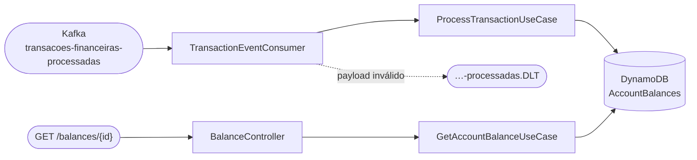
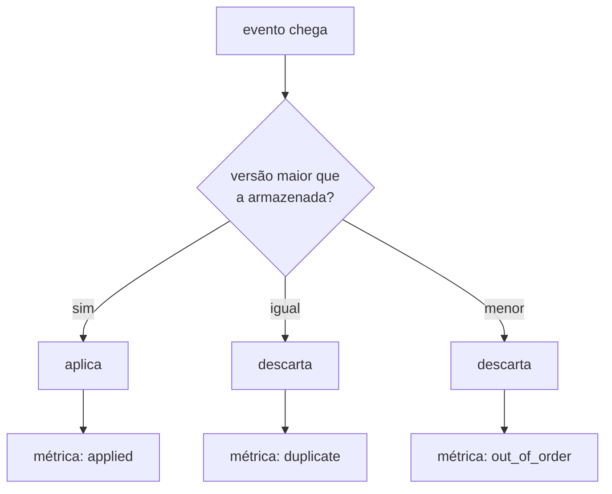
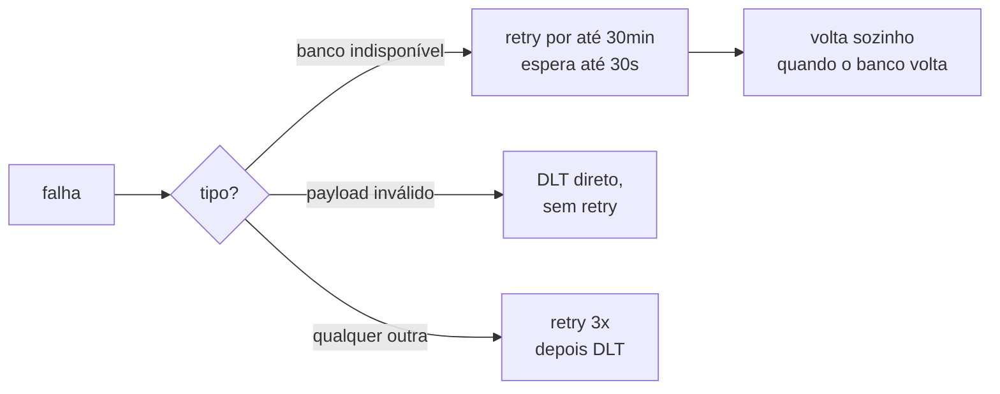

# API de Consulta de Saldo — Desafio Técnico Itaú Unibanco

[](../../actions/workflows/build.yml)
[](../../actions/workflows/test.yml)
[](../../actions/workflows/docker.yml)
[](../../actions/workflows/codeql.yml)

Consome transações financeiras de um tópico Kafka, projeta o saldo de cada conta no DynamoDB e
expõe esse saldo por um endpoint REST.

```bash
make up                                                               # sobe tudo
make kafka-produce-scenario TOPIC=transacoes-financeiras-processadas  # publica um cenário
curl http://localhost:8080/balances/{accountId}                       # consulta o saldo
```

- [Arquitetura](#arquitetura) · [Decisões](#decisões-de-design) · [Fora de escopo](#o-que-não-foi-implementado)
- [Como rodar](#como-rodar) · [Cenários difíceis](#como-verificar-os-cenários-difíceis) · [Contrato](#contrato-da-api)
- [Configuração](#configuração) · [Reprocessamento](#runbook-reprocessar-o-tópico) · [Testes](#testes) · [Uso de IA](#sobre-o-uso-de-ia)

## Arquitetura



Arquitetura hexagonal, seguindo o starter-kit: o domínio não conhece Spring, Kafka nem AWS.
`HexagonalArchitectureTest` (Konsist) quebra o build se uma camada violar a direção de dependência
— incluindo três verificações próprias: o núcleo não importa `org.springframework`,
`software.amazon.awssdk` nem `org.apache.kafka`.

O acoplamento real, medido por imports:

| Camada | Conhece |
|-|-|
| `domain` | nada — nenhuma tecnologia |
| `port` | nada |
| `application` | só Spring (`@Service`, `@Value`) |
| `adapter` | Kafka, AWS SDK, Swagger, Micrometer |

Trocar o banco custa 4 arquivos; trocar o broker, 5. A regra de negócio não muda em nenhum dos dois.

## Decisões de design

### 1. Projeta um snapshot, não acumula um ledger

Cada evento traz `account.balance` **já apurado pelo autorizador**. O saldo não é recalculado
somando créditos e débitos — o que exigiria entrega exata e ordenada, nada disso garantido pelo
Kafka entre partições.

| | Ledger (acumula) | Snapshot (projeta) |
|-|-|-|
| Evento perdido | erro **permanente** em todos os saldos futuros | o próximo evento **corrige sozinho** |
| Evento duplicado | credita duas vezes | operação idempotente |

É essa autossuficiência de cada evento que permite resolver duplicatas e desordem comparando
versões.

### 2. Modelagem no DynamoDB

Tabela `AccountBalances`, **um item por conta**, partition key `accountId`:

| Atributo | Tipo | Papel |
|-|-|-|
| `accountId` | S | **partition key** |
| `owner` | S | titular |
| `balanceAmount` / `balanceCurrency` | N / S | saldo decimal exato + ISO 4217 |
| `lastTransactionId` | S | qual transação produziu este saldo |
| `version` | N | timestamp da transação em µs — a versão do snapshot |
| `updatedAt` | S | cópia legível, **somente escrita** |

**Sem sort key.** Serviria para histórico, mas o histórico já existe na fonte: o Kafka retém os
eventos e a projeção é determinística, então a tabela pode ser reconstruída reprocessando do offset
zero. Materializar aqui custaria escrita em toda ingestão e trocaria o `GetItem` por um `Query` no
caminho crítico. Se virasse requisito, uma **tabela separada** seria melhor que o híbrido
`v#<version>` + `CURRENT`: isola capacidade, TTL e perfil de acesso, e a perda de atomicidade não
custa nada porque cada evento é um snapshot idempotente.

**Sem GSI.** O único candidato seria `owner`, para investigações que partem do titular. Descartado
por um defeito que precede o custo: **este serviço só conhece contas que já transacionaram**, então
responderia "estas duas" para quem tem três, sem indicar que a resposta está incompleta. Essa
pergunta pertence ao cadastro de contas. A necessidade real foi resolvida por um campo no log, não
por um índice.

### 3. Uma condição resolve três problemas

```
attribute_not_exists(accountId) OR version < :version
```

O DynamoDB avalia isso **dentro da escrita**, na partição dona do item — atômico mesmo com várias
instâncias gravando a mesma conta no mesmo microssegundo.



Como a comparação é **estrita**, uma duplicata tem versão *igual* — não menor — e é rejeitada.
Idempotência sem tabela de deduplicação para manter e expirar.

> O produtor publica **sem chave**, então eventos de uma conta se espalham entre partições e são
> consumidos em paralelo. A correção não pode vir do broker: vem da escrita condicional. Os testes
> publicam sem chave de propósito.

### 4. Precisão monetária, e um comportamento que muda o contrato

Todo valor é `BigDecimal`, nunca `Double`. E o **DynamoDB remove zeros à direita**: um saldo
gravado como `300.00` volta como `300`, e a API responderia `"amount": 300` para reais.

Por isso `Money` normaliza a escala pela moeda via `java.util.Currency` — BRL tem 2 casas, JPY tem
0, BHD tem 3. Precisão maior que a moeda admite é **rejeitada**, nunca arredondada: arredondar
dinheiro em silêncio é como centavos somem.

### 5. Frescor: rejeitar eventos do futuro

A ordenação confia num timestamp produzido por outro sistema, e essa confiança tem um custo. Um
evento com timestamp absurdamente no futuro venceria todos os seguintes e **congelaria a conta** —
o saldo pararia de atualizar em silêncio até a data chegar.

Basta o produtor enviar nanossegundos em vez de microssegundos. Eventos além de
`balance.max-clock-skew` (5 min) vão para o DLT, onde ficam visíveis em vez de envenenar a conta.

### 6. Resiliência



Nem todo erro do banco entra na primeira categoria. Throttling, `5xx` e falha de rede melhoram
sozinhos; já um `4xx` — item acima do limite de tamanho, atributo com tipo inválido — significa que
a **requisição** está errada, e ela vai falhar exatamente igual daqui a 30 minutos. Tratar os dois
igual ocuparia a partição por meia hora retentando o impossível, com as mensagens boas esperando
atrás. Por isso o adaptador classifica antes de traduzir, e o `4xx` vai direto ao dead letter
topic.

A distinção entre a primeira e a terceira é a que evita quarentenar transação válida.
Indisponibilidade **melhora sozinha**; um defeito no código, não. Com um backoff curto para os
dois casos, poucos segundos de banco fora bastam para mandar eventos legítimos ao dead letter
topic — medido: 35 segundos derrubaram dois eventos válidos. Insistindo por 30 minutos, o offset
não avança, o lag cresce, e o backlog é drenado sozinho quando a dependência volta.

Longo, porém **finito**. Retentar para sempre trocaria esse problema por um pior: a partição
parada indefinidamente e sem alarme próprio, já que o Spring Kafka registra as tentativas apenas
em `DEBUG` — o sintoma seria um lag crescendo sem nenhuma linha de log explicando.

Retentar um payload malformado, ao contrário, não adianta nunca — e travaria a partição inteira
atrás dele. O jitter existe porque uma indisponibilidade atinge todas as threads ao mesmo tempo, e
backoff idêntico as faria martelar o banco em ondas sincronizadas no momento em que ele se
recupera.

**Timeouts explícitos no AWS SDK**, cujo `apiCallTimeout` padrão é *ilimitado*: sem ele, uma
partição que para de responder prende uma thread do Tomcat para sempre.

**Tópicos declarados como beans** — o Redpanda tem auto-criação desligada, e sem isso a aplicação
subiria saudável consumindo zero mensagens. O DLT precisa existir antes de ser necessário.

### 7. Leitura consistente e erros como contrato

`GetItem` usa `consistentRead(true)`. Custa o dobro e evita servir saldo defasado a quem acabou de
ver a transação confirmada.

Erros em `application/problem+json` (RFC 7807), na API inteira:

| Situação | Status |
|-|-|
| Saldo não projetado | `404` |
| `accountId` não é UUID | `400`, antes de tocar o banco |
| Banco indisponível | `503` — **não 500**: sinaliza que retentar é a resposta certa |
| Falha inesperada | `500` com mensagem neutra |
| Rota/método inválido | `404`/`405`, **no mesmo formato** |

Isso exige dois advices com ordens opostas: os handlers específicos precisam de
`HIGHEST_PRECEDENCE` para vencer o handler do Spring em `MethodArgumentTypeMismatchException`,
enquanto o catch-all `Exception` precisa de `LOWEST_PRECEDENCE` — com precedência alta ele
capturaria as exceções do framework e transformaria um `405` em `500`.

Detalhes internos nunca cruzam essa fronteira: vão para o log, e há teste garantindo que host
interno, credencial e nome de classe não aparecem no corpo de um `500`.

### 8. Observabilidade

Métricas por **resultado**, não só throughput — um consumidor que descarta tudo parece tão ocupado
quanto um saudável numa contagem bruta:

```
balance_transactions_processed_total{outcome="applied|duplicate_discarded|out_of_order_discarded|declined_skipped"}
balance_transactions_rejected_total
```

Os contadores são registrados **na inicialização**: uma série que só aparece no primeiro evento é
armadilha para alertas, porque "taxa zero" e "série inexistente" são condições diferentes.

Logs em JSON (ECS) quando `LOG_FORMAT=ecs`, com identificadores no **MDC** — campos, não texto:

```json
{ "message": "Evento fora de ordem descartado: o saldo armazenado já é mais recente",
  "account": "1277d415-…", "owner": "83360aee-…", "version": "1788293030916214" }
```

`owner` está nos **dois** caminhos, com o mesmo nome, então uma consulta devolve ingestão e
consulta do mesmo titular em ordem cronológica. O log de acesso HTTP registra método, rota, status,
duração e origem; o actuator fica de fora para as probes não afogarem o agregador.

O caminho feliz fica em `DEBUG` — o rastro definitivo está no item persistido e no evento retido
pelo Kafka. Investigação pontual: subir o nível do pacote, sem deploy.

**Health do Kafka fora das probes.** Com o broker fora, a API segue respondendo consultas e a
readiness segue `UP` — correto, porque a leitura vem do DynamoDB e derrubar a instância degradaria
o serviço que ainda funciona. Mas sem um indicador, nada revelaria que a **ingestão** parou: os
saldos congelariam em silêncio. O componente `kafka` entra no health geral, para monitoração, e
fora de liveness e readiness, para que nenhuma decisão do orquestrador dependa dele.

Ele verifica os dois tópicos separadamente, e não numa chamada só, para o alarme apontar qual
falta — "o Kafka caiu" e "alguém apagou o DLT" pedem ações diferentes. A ausência do dead letter
topic é a mais traiçoeira: o consumo segue normal até aparecer um payload inválido, e aí o
recoverer não tem para onde publicar e a partição trava. Medido: com o DLT apagado, um evento
inválido ficou preso com lag 1, e o tópico não volta sozinho — o `KafkaAdmin` só cria na
inicialização.

**Health com readiness que reflete a dependência.** Um `HealthIndicator` verifica a tabela e entra
apenas no grupo de readiness — a liveness segue sem dependências externas, porque cair junto
colocaria o orquestrador em ciclo de reinício durante a indisponibilidade. A verificação usa
`GetItem` numa chave reservada, e **não** `DescribeTable`: esta é operação de *control plane*, com
limite compartilhado por conta e região, que viraria fonte de throttling numa probe de segundos.

**Graceful shutdown** ligado: sem ele, todo deploy devolve erro a quem estava sendo atendido.

## O que não foi implementado

### Circuit breaker — decisão, não esquecimento

O critério diz *"onde oportuno"*, e saber onde **não** aplicar é parte da resposta.

**Onde faria sentido:** no caminho de leitura. Se o DynamoDB degrada, o pool do Tomcat esgota e a
API cai junto; um breaker converte falha lenta em falha rápida. Os timeouts do SDK já cobrem boa
parte disso.

**Onde eu deliberadamente não aplicaria:** no consumidor. Ali o Kafka já *é* o breaker — o offset
não avança, o lag cresce, o backlog é drenado depois. Um breaker aberto faria mensagens válidas
caírem no DLT sem necessidade.

**Como implementaria:** `resilience4j-circuitbreaker` (módulo core, sem Spring) como decorator
sobre a porta — não o starter, construído sobre Framework 6 enquanto este projeto roda o 7. Não
existe `resilience4j-spring-boot4`.

### Outros pontos

| Item | Situação |
|-|-|
| Autenticação | fora do escopo; em produção o endpoint estaria atrás de gateway, e o actuator não ficaria com `show-details: always` |
| Credenciais estáticas da AWS | necessárias para o DynamoDB Local; em produção seriam IAM roles |
| Reprocessamento do DLT | mensagens ficam retidas para inspeção; o passo natural é um job de replay com deduplicação por `transaction.id` |
| Tracing distribuído | propagar o `traceId` do autorizador permitiria seguir uma transação ponta a ponta |
| Cache de leitura | deliberadamente ausente — saldo é onde staleness custa mais caro |
| `account.status` | carregado e validado, mas não filtra eventos: uma conta encerrada tem saldo, e é o que o suporte precisa ver |
| Colisão de timestamp | duas transações no mesmo microssegundo: a segunda vira duplicata. Improvável, e o desempate exigiria compor a versão com o `transaction.id` |

## Como rodar

Pré-requisito único: **Docker**. `make` já vem em Linux e macOS; no Windows, use WSL2.

```bash
make up      # sobe app + DynamoDB + Redpanda + seeds + consoles
make logs    # acompanha os logs
make stop    # derruba tudo
```

| Console | URL | Console | URL |
|-|-|-|-|
| Aplicação | `:8080` | DynamoDB Admin | `:8001` |
| Swagger UI | `:8080/swagger-ui/index.html` | Redpanda Console | `:8081` |
| Health | `:8080/actuator/health` | Métricas | `:8080/actuator/prometheus` |

Para rodar pela IDE: `make db-up` e `make kafka-up` sobem só a infraestrutura, e os padrões do
`application.yaml` já apontam para as portas certas.

## Como verificar os cenários difíceis

O gerador do starter-kit sorteia um `accountId` novo a cada evento, então **nunca produz dois
eventos da mesma conta** — não exercita desordem, duplicata nem concorrência. Para isso:

```bash
make kafka-produce-scenario TOPIC=transacoes-financeiras-processadas
```

Publica 6 eventos para **uma única conta**, sem chave Kafka:

| # | Evento | Esperado |
|-|-|-|
| 1 | `t2`, saldo 200.00 | aplicada |
| 2 | `t1`, saldo 100.00 | **descartada** — fora de ordem |
| 3 | `t3`, saldo 300.00 | aplicada |
| 4 | réplica de `t3` | **descartada** — duplicata |
| 5 | réplica de `t2` | **descartada** — obsoleta |
| 6 | `type: "TRANSFER"` | **dead-letter**, saldo intacto |

Saldo final: **300.00**, independentemente da ordem de processamento. As métricas contam a história:

```
balance_transactions_processed_total{outcome="applied"}                 2.0
balance_transactions_processed_total{outcome="out_of_order_discarded"}  2.0
balance_transactions_processed_total{outcome="duplicate_discarded"}     1.0
balance_transactions_rejected_total                                     1.0
```

```bash
make db-scan                                                     # itens no DynamoDB
make kafka-consume TOPIC=transacoes-financeiras-processadas.DLT  # quarentena
```

## Contrato da API

### `GET /balances/{accountId}`

```json
{
  "id": "5b19c8b6-0cc4-4c72-a989-0c2ee15fa975",
  "owner": "315e3cfe-f4af-4cd2-b298-a449e614349a",
  "balance": { "amount": 183.12, "currency": "BRL" },
  "updated_at": "2025-07-04T12:02:44.589998-03:00"
}
```

`updated_at` tem **largura fixa** — sempre 6 dígitos de fração e offset explícito. O formatador ISO
padrão do Java imprime o mínimo de dígitos (`.4848` num caso, nada num segundo cheio), e um
consumidor com layout fixo quebraria na variante que encontrasse depois.

O instante vem do **timestamp da transação**, não do relógio do servidor: significa "quando este
saldo passou a valer", e torna a projeção determinística.

Erros: `400` (UUID malformado), `404` (sem saldo), `503` (banco indisponível), `500` (inesperado),
todos em `application/problem+json`.

## Configuração

| Variável | Padrão | Descrição |
|-|-|-|
| `DYNAMODB_ENDPOINT` / `DYNAMODB_REGION` | `http://localhost:8000` / `us-east-1` | conexão |
| `BALANCE_TABLE_NAME` | `AccountBalances` | tabela |
| `DYNAMODB_API_CALL_ATTEMPT_TIMEOUT_MS` | `1000` | timeout de uma tentativa |
| `DYNAMODB_API_CALL_TIMEOUT_MS` | `3000` | timeout da chamada, com retries |
| `KAFKA_BOOTSTRAP_SERVERS` | `localhost:19092` | broker |
| `KAFKA_CONSUMER_GROUP_ID` | `balance-transaction-consumer` | consumer group |
| `KAFKA_LISTENER_CONCURRENCY` | `3` | threads (uma por partição) |
| `TRANSACTIONS_TOPIC` / `..._PARTITIONS` | `transacoes-financeiras-processadas` / `3` | tópico e DLT |
| `APPLY_DECLINED_TRANSACTIONS` | `true` | se DECLINED atualiza o saldo |
| `MAX_CLOCK_SKEW` | `5m` | tolerância para eventos adiantados |
| `API_TIME_ZONE` | `America/Sao_Paulo` | fuso de `updated_at` |
| `LOG_FORMAT` | *(vazio)* | `ecs` para JSON estruturado |
| `REPLAY_MODE` | `false` | modo de reprocessamento — ver [runbook](#runbook-reprocessar-o-tópico) |

### Sobre `apply-declined-transactions`

Uma transação DECLINED deve atualizar o saldo? A especificação não diz, então virou flag em vez de
regra escondida.

**Padrão `true`:** uma recusa carrega um snapshot válido — o autorizador avaliou a conta naquele
microssegundo. Descartar significaria ignorar a leitura mais recente do sistema. Com `false`, só
APPROVED atualiza — leitura mais conservadora, correta se o autorizador emitir saldo
pré-autorização nas recusas. A corretude se mantém nos dois modos; muda o frescor.

## Runbook: reprocessar o tópico

O saldo é uma projeção determinística do tópico, então reconstruí-lo é operação de rotina. Provado
em teste: reprocessar tudo produziu um estado **byte a byte idêntico** — mesmo hash das 518 contas
antes e depois. Num serviço que acumulasse saldo, o mesmo procedimento duplicaria todos os valores.

O reprocessamento sobe uma instância **adicional**, com `group.id` exclusivo, enquanto a de
produção segue atendendo. Grupos de consumo têm offsets independentes, então uma não interfere na
outra; as duas gravam na mesma tabela, o que é inofensivo porque a escrita condicional descarta o
que já foi aplicado. Nenhuma janela de indisponibilidade é necessária.

### Localmente

```bash
make replay
```

`infra/replay.sh` gera um `group.id` único, sobe a instância com `REPLAY_MODE=true`, acompanha o
lag até zerar e a derruba. O actuator dela fica em `localhost:8090`, separado da produção. Saída de
uma execução real:

```
group-id do replay: balance-replay-20260902-115630
  lag: 0
  reprocessamento concluído
    balance_transactions_processed_total{outcome="applied"}              0.0
    balance_transactions_processed_total{outcome="duplicate_discarded"}  120.0
```

Tudo relido, nada alterado — e a instância de produção manteve as métricas intactas durante todo o
processo.

### Em produção na AWS (ECS)

Não é preciso novo *service* nem nova task definition. Uma **task avulsa**, reaproveitando a
definition existente e sobrescrevendo apenas as variáveis de ambiente:

```bash
aws ecs run-task \
  --cluster producao --task-definition balance-api:42 --launch-type FARGATE \
  --network-configuration "awsvpcConfiguration={subnets=[subnet-a],securityGroups=[sg-xxx]}" \
  --overrides '{"containerOverrides":[{"name":"app","environment":[
      {"name":"REPLAY_MODE","value":"true"},
      {"name":"KAFKA_CONSUMER_GROUP_ID","value":"balance-replay-2026-09-02"}]}]}'
```

Task avulsa, e não um service, por três razões: ela **não é registrada no load balancer**, então não
recebe tráfego HTTP; não conflita com as políticas de autoscaling; e termina sozinha, sem precisar
ser deletada depois. Herda a mesma task role, então já tem as permissões de DynamoDB e do broker.
Ao concluir, `aws ecs stop-task`.

### A proteção que o modo replay adiciona

`REPLAY_MODE=true` não muda o que a aplicação faz — ela consome e projeta igual. O que ele ativa é
uma checagem na inicialização: se o `group.id` for o de produção, a aplicação **recusa subir**.

Sem isso, esquecer de trocar o `group.id` faria a instância de replay entrar no grupo que está
servindo, disparar um rebalanceamento e disputar as partições com ele — um incidente nascido de uma
operação rotineira. E seria silencioso: nada falha, o consumo continua, e só o lag e a latência
denunciariam. Falhar na inicialização é barato; descobrir depois, no meio do reprocessamento, não é.

### Três cuidados em produção

**Capacidade do DynamoDB.** O replay gera uma rajada de escrita. Em *on-demand* escala sozinho; em
*provisioned* o throttling é provável — e aí o retry longo segura o replay sem perder nada, mas
vale subir a capacidade antes ou escolher uma janela de baixo movimento.

**Retenção do tópico.** Só se reprocessa o que ainda está no broker. Se a retenção é de sete dias,
"reprocessar tudo" significa os últimos sete dias.

**Transferência de dados.** Reler o tópico inteiro gera tráfego de rede, cobrado quando as tasks
ficam em zona diferente dos brokers.

### Reprocessar o dead letter topic

O DLT não é consumido por ninguém — as mensagens ficam retidas para inspeção. Reprocessar significa
**republicar** no tópico principal:

```bash
docker compose exec redpanda bash -c \
  "rpk topic consume transacoes-financeiras-processadas.DLT --brokers redpanda:9092 \
     --offset start --format '%v\n' \
   | rpk topic produce transacoes-financeiras-processadas --brokers redpanda:9092 -f '%v\n'"
```

Duas precauções: republicar **antes de corrigir a causa** devolve os eventos direto ao DLT; e o DLT
também é *at-least-once*, então o mesmo evento pode estar lá mais de uma vez — para o saldo é
indiferente, já que a cópia extra é descartada como duplicata.

## Testes

```bash
make test               # unitários + gate de cobertura ≥ 90%, em container
make integration-test   # integração contra DynamoDB e Redpanda reais
```

**Cobertura: 97%** de instruções. **13 testes de integração**, porque provam o que mock nenhum
prova — se a condição rejeita mesmo uma versão igual é pergunta sobre o DynamoDB, não sobre este
código:

- **`converge para a versão mais recente independentemente da ordem de chegada`** — aplica os
  mesmos três eventos em **todas as permutações**
- **`sob escrita concorrente a versao mais recente vence`** — 16 threads sincronizadas por barreira
  disputando o mesmo item: o cenário do enunciado, dois débitos no mesmo instante
- **`sob escrita concorrente do mesmo evento apenas uma vence`** — idempotência sob corrida
- **`manda um evento inprocessável ao DLT e deixa o saldo intacto`** — consome o DLT e confirma

Os nomes de teste estão em português: a saída do build documenta os corner cases exigidos.

> Estes testes encontraram o truncamento de zeros do DynamoDB descrito na
> [decisão 4](#4-precisão-monetária-e-um-comportamento-que-muda-o-contrato). Ele não aparecia em
> nenhum teste unitário.

## Estrutura de pastas

```
src/main/kotlin/br/com/itau/challenge/balance/
├── domain/          # modelos e exceções — sem framework algum
├── port/            # contratos de entrada e saída
├── application/     # casos de uso
└── adapter/
    ├── input/kafka/ # consumer, mapper, métricas, error handler + DLT
    ├── input/web/   # controller, problem details, log de acesso, OpenAPI
    └── output/dynamodb/  # escrita condicional, leitura consistente, health

src/test/ · src/integrationTest/ · infra/ · http/
```

## Sobre o uso de IA

Usei IA como par de programação (Claude Code). O princípio: **a IA escreve e executa, as decisões
de projeto são minhas, e nada entra sem verificação por execução.**

### Como conduzi

Pedi a leitura da especificação e um plano antes de qualquer código, e a partir dele tomei as
decisões estruturais — sempre pedindo alternativas e trade-offs antes de escolher:

| Decisão | O que pesou |
|-|-|
| Kotlin sobre Java | familiaridade e concisão no domínio |
| Flag para DECLINED | a especificação é ambígua; preferi explicitar a ambiguidade a escondê-la |
| Remover o código de exemplo | evitar que o avaliador separe o que é meu do que é template |
| **Não implementar circuit breaker** | pedi a análise, vi que não existe `resilience4j-spring-boot4` e que o consumidor já tem o Kafka como buffer |
| Português em comentários, testes e logs | o avaliador lê em português; a saída dos testes vira documentação |

### Perguntas que mudaram o código

| Pergunta | O que produziu |
|-|-|
| *"E se não houver `accountId` para fazer a busca?"* | a análise do GSI por `owner` e o campo indexável no log |
| *"Como está o critério de production readiness?"* | revelou que o `application.yaml` prometia readiness com dependência e não entregava |
| *"Me mostre os logs de uma execução ponta a ponta"* | três defeitos: sem log de acesso, causa raiz escondida no DLT, identificadores não pesquisáveis |
| *"Não faz sentido logar a mensagem commitada, certo?"* | **evitou** código — o lag já observa o commit, e o registro do que foi salvo já está no item |
| *"Revise o código procurando o que passou despercebido"* | encontrou o bug crítico de timestamp descrito abaixo |

### O que só apareceu executando

**O DynamoDB remove zeros à direita.** `300.00` volta como `300`, e a API responderia
`"amount": 300` para reais. Nenhum teste unitário pegava.

**Habilitar `problemdetails` sobrepôs handlers próprios.** Dois testes quebraram ao ligar a
propriedade, revelando uma disputa de precedência entre advices.

**Indisponibilidade do banco quarentenava transações válidas.** O README afirmava que "o Kafka já
é o buffer: se o banco cai, o offset não avança e o backlog é drenado depois" — mas o backoff era
finito para qualquer falha. Medido: 35 segundos de DynamoDB fora mandaram dois eventos legítimos ao
dead letter topic, de onde só sairiam por intervenção manual. Agora a política depende do tipo da
falha, e o mesmo teste com 45 segundos fora resulta em zero quarentenados e cinco contas
recuperadas sozinhas.

**Identificadores não eram normalizados.** Um evento com `accountId` em maiúsculas era gravado
naquela grafia, mas a API converte o path para `UUID` antes de consultar — o que sempre produz
minúsculas. O saldo ficava **inacessível pelas duas grafias**: gravado com sucesso, 404 na
consulta. `UUID.fromString` ainda aceita formas abreviadas (`1-1-1-1-1`), o que multiplicava as
grafias possíveis da mesma chave. Agora o domínio guarda sempre a forma canônica.

**Um timestamp no futuro congelava a conta.** A revisão final expôs que a validação só exigia
`> 0`. Reproduzindo: um evento com timestamp em nanossegundos gravou `updated_at: +58639-01-13` e
**o evento legítimo seguinte foi rejeitado** — o saldo ficou preso permanentemente, sem erro em
lugar nenhum. É a fraqueza estrutural do *last-write-wins*: ele confia no relógio de quem produz.
Virou a [decisão 5](#5-frescor-rejeitar-eventos-do-futuro).

Os três foram encontrados executando, não lendo código — e é por isso que a suíte tem 13 testes de
integração contra infraestrutura real.

### O que a IA fez

Escreveu o código sob as decisões acima, pesquisou APIs do Spring Boot 4 quando o conhecimento
prévio não era confiável — foi assim que apareceu que `ExponentialBackOffWithMaxRetries` não existe
mais e que `HealthIndicator` mudou de pacote —, executou testes e a stack completa, e apresentou
opções com trade-offs quando havia mais de um caminho defensável.

Também errou e foi corrigida: uma data calculada errada num teste, um YAML com chave duplicada que
derrubou o contexto, uma sequência de merges fora de ordem que deixou commits para trás. Todos
apareceram na execução e foram corrigidos antes de seguir.

O histórico de pull requests registra a sequência, incluindo as correções.
